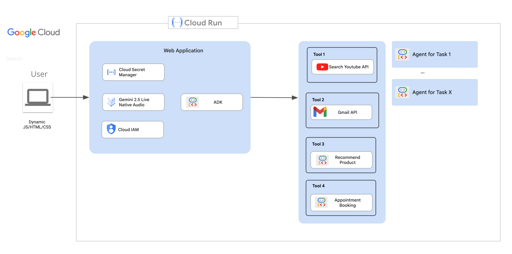

# Quick start for Live API retail demo

Author: `Wei Yih Yap`, Gen AI FSA

## Prerequisites
- Setup `.env` file
- Setup gcloud `gcloud auth login`
- Setup ADC `gcloud auth application-default login`

- Generate a Desktop type client using `Google Auth Platform`. Setup required permission and then download the credential `credentials.json`
- Generate `gmail_token.json` (must be this filename) by running the following
```bash
cd dyson-ebc-repo/ces/backend/server
uv run secret_manager.py
# click browser to authenticate if necessary
```

- Setup gmail token secret key: `gcloud secrets create gmail-token --data-file=gmail_token.json`
- Backend cloudrun service account need to have the required permission.

# Virtual Env
```bash
uv sync
```

# Local Run
- `make client-local`
- `make backend-local`
- Browse to `http://localhost:8000/index.html`


## Cloud Run
- `make client-cloudrun-deploy`
- `make backend-cloudrun-deploy`
- Browse to `https://live-agent-ui-xxx.us-central1.run.app`


## High Level Architecture

